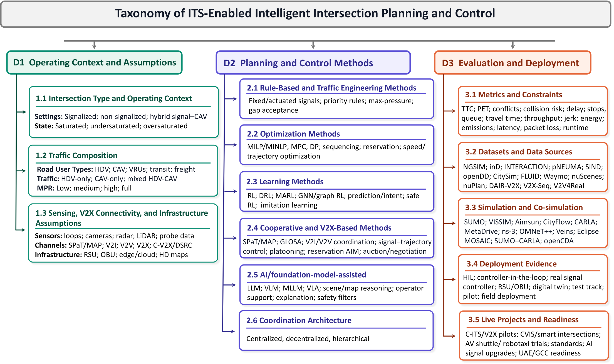

# Awesome Intelligent Intersections

<p align="center">
  <a href="docs/references.md"></a>
  <a href="docs/papers.md"></a>
  <a href="docs/code.md"></a>
  <a href="docs/code.md"></a>
  <a href="docs/datasets.md"></a>
  <a href="docs/benchmarks.md"></a>
  <a href="docs/simulators.md"></a>
  
</p>

A taxonomy-driven collection of research, implementations, datasets, benchmarks, simulation platforms, and deployment evidence for **ITS-enabled intelligent-intersection planning and control**.

This repository accompanies the survey:

> **From Challenges to Deployment: A Survey on Intelligent Intersection Planning and Control With Connected Autonomous Vehicles and Mixed Traffic**  
> Abdulrahman Ahmad, Ameena S. Al-Sumaiti, Sumbal Malik, Young Ji Byon, Khalifa Al Hosani, and Majid Khonji.  
> *Manuscript in preparation.*

The collection covers signalized, non-signalized, hybrid signal-CAV, and signal-free autonomous intersection management (AIM), with explicit attention to mixed traffic, CV/CAV market penetration rate (MPR), vulnerable road users (VRUs), V2X assumptions, evaluation evidence, and deployment readiness.

<p align="center">
  
</p>

## Explore the collection

| Topic | What it contains |
|---|---|
| [Complete citation catalog](docs/references.md) | All 261 distinct works represented by 266 active citation keys, categorized by role and survey section with source links |
| [Code and implementation index](docs/code.md) | 73 code-linked works mapped to 69 distinct repositories, separated into methods, datasets, benchmarks, and tools |
| [Core comparison papers](docs/papers.md) | 46 deeply coded papers with operating context, traffic composition, method family, evidence level, and verified code status |
| [Signalized intersections](docs/signalized-intersections.md) | Signal timing, estimation, signal-trajectory coordination, learning, multimodal and priority-aware control |
| [Non-signalized intersections and AIM](docs/non-signalized-and-aim.md) | Gap acceptance, reservation AIM, distributed control, mixed traffic, negotiation, learning |
| [Mixed traffic and MPR](docs/mixed-traffic-and-mpr.md) | Capability-based interpretation of penetration, observability, controllability, and reporting requirements |
| [Foundation-model assistance](docs/foundation-models.md) | LLM, VLM, MLLM, and VLA roles, authority boundaries, verification, and fallback |
| [Datasets](docs/datasets.md) | Intersection context, data modalities, acquisition, participants, scale, and supported tasks |
| [Benchmarks](docs/benchmarks.md) | Formal benchmarks, benchmark-ready resources, and simulation-ready scenarios |
| [Simulation and co-simulation](docs/simulators.md) | Traffic, autonomy, V2X, and multidomain platforms with capabilities and limitations |
| [Deployment readiness](docs/deployment-readiness.md) | E0-E3 validation environments, deployed architectures, programs, and remaining evidence gaps |

## Taxonomy

Every included study can be described across three coupled dimensions instead of being placed in only one topic bucket:

| Dimension | Questions captured |
|---|---|
| **D1 - Operating context and assumptions** | Intersection type, traffic composition, MPR, sensing, V2X, infrastructure, and control authority |
| **D2 - Planning and control methods** | Rule-based/traffic-engineering, optimization, learning, cooperative V2X, foundation-model assistance, and coordination architecture |
| **D3 - Evaluation and deployment** | Metrics, datasets, simulators, validation environment, field evidence, and readiness factors |

This representation prevents a full-CAV simulation result from being interpreted as evidence for low-penetration mixed traffic or public-road deployment.

## Recent updates

- **2026-08-27 — Link-integrity and provenance audit:** separated publication, project, and code links; removed one dead repository from the verified count; and added artifact and verification fields.
- **2026-08-27 — Implementation expansion:** increased verified code coverage across methods, datasets, benchmarks, and simulators.
- **2026-08-27 — Complete manuscript catalog:** synchronized all 261 distinct cited works represented by 266 active citation keys.

See the [changelog](CHANGELOG.md) for details.

## Implementation-aware paper records

The [full code and implementation index](docs/code.md) contains **73 code-linked works mapped to 69 distinct public repositories**, grouped into method papers, datasets, benchmarks, and simulation tools. Of these, **17 are method-paper implementations** and **56 are executable research resources**. Code links are checked against the publication, author, laboratory, project page, or repository README. A dash in the complete catalog means that no public implementation was located as of the record's `last_verified` date; it does **not** prove that code does not exist.

| Paper | Context | Method | Code |
|---|---|---|---|
| [PressLight](https://doi.org/10.1145/3292500.3330949) | Signalized | Learning | [Official](https://github.com/wingsweihua/presslight) |
| [CoLight](https://doi.org/10.1145/3357384.3357902) | Signalized network | Learning | [Official](https://github.com/wingsweihua/colight) |
| [LLMLight](https://doi.org/10.1145/3690624.3709379) | Signalized | Foundation-model-assisted | [Official](https://github.com/usail-hkust/LLMTSCS) |
| [CoLLMLight](https://openreview.net/forum?id=KeJqoEVOeY) | Signalized network | Foundation-model-assisted | [Official](https://github.com/usail-hkust/CoLLMLight) |
| [PromptGAT](https://doi.org/10.1609/aaai.v38i1.27758) | Signalized | Foundation-model-assisted transfer | [Official](https://github.com/DaRL-LibSignal/PromptGAT) |
| [TrafficGPT](https://doi.org/10.1016/j.tranpol.2024.03.006) | Cross-cutting | Tool orchestration | [Official](https://github.com/lijlansg/TrafficGPT) |
| [IntelliLight](https://doi.org/10.1145/3219819.3220096) | Signalized | Learning | [Author-released](https://github.com/wingsweihua/IntelliLight) |
| [PAIM](https://doi.org/10.1109/ITSC.2018.8569782) | Non-signalized | Reservation/platooning | [Author-released](https://github.com/ashkanbashiri/PAIM) |
| [VLMLight](https://mlanthology.org/neurips/2025/wang2025neurips-vlmlight/) | Signalized | Vision-language meta-control | [Official](https://github.com/Traffic-Alpha/VLMLight) |

See the [full implementation table](docs/code.md), the [core comparison-paper index](docs/papers.md) for detailed D1-D3 records, and the [complete citation catalog](docs/references.md) for every work cited in the manuscript.

## Resource snapshot

The repository distinguishes complete citation coverage from the smaller, deeply coded comparison subset:

- **261** distinct cited works represented by **266** active citation keys, with duplicate BibTeX aliases consolidated and retained;
- **46** core comparison papers across signalized, non-signalized/AIM, mixed-traffic, and foundation-model-assisted methods;
- **73** code-linked cited works mapped to **69 distinct repositories**: 62 official/project, 10 author-released, and 1 clearly labeled third-party relationship;
- **17/90 method papers** have verified public implementations; resource repositories are reported separately so they are not mistaken for algorithm implementations;
- **44** operational, trajectory, interaction, motion-planning, and cooperative-perception datasets;
- **13** formal benchmarks and benchmark-supporting scenario resources;
- **19** traffic, automated-driving, V2X, and multidomain simulation platforms;
- **8** control-architecture and program-level deployment records.

The manuscript's larger BibTeX database includes uncited records; the 266-key count intentionally reflects the active `\\cite{...}` set. The machine-readable source files are in [`data/`](data/). Generated resource pages can be rebuilt with:

```bash
python scripts/build_pages.py
python scripts/validate_repository.py
```

## Scope rules

Included resources must directly support intersection-level planning, control, coordination, evaluation, or deployment. Freeway automation, parking, generic smart-city mobility, and full-stack automated-driving resources are included only when they contribute direct intersection-level evidence or reusable evaluation support.

Foundation-model work is tagged as:

- **Direct** - generates or coordinates candidate intersection-control actions;
- **Enabling** - supports understanding, adaptation, tool use, simulation, or operator interaction;
- **Adjacent** - relevant autonomous-driving evidence without direct validation as an intersection-management system.

## Contributing

Community additions and corrections are welcome. Please read [CONTRIBUTING.md](CONTRIBUTING.md) and use the structured issue forms. New entries should provide a stable paper/resource link, taxonomy tags, and an implementation link only when its relationship to the publication can be verified.

## Citation

The survey citation will be updated after a preprint or DOI becomes available. Until then, cite this repository using [`CITATION.cff`](CITATION.cff) and describe the survey as a manuscript in preparation.

## License

Repository software and original documentation are released under the [MIT License](LICENSE). Survey figures retain the manuscript notice in [`assets/figures/README.md`](assets/figures/README.md). Third-party papers, software, datasets, and trademarks remain subject to their respective licenses and terms.
