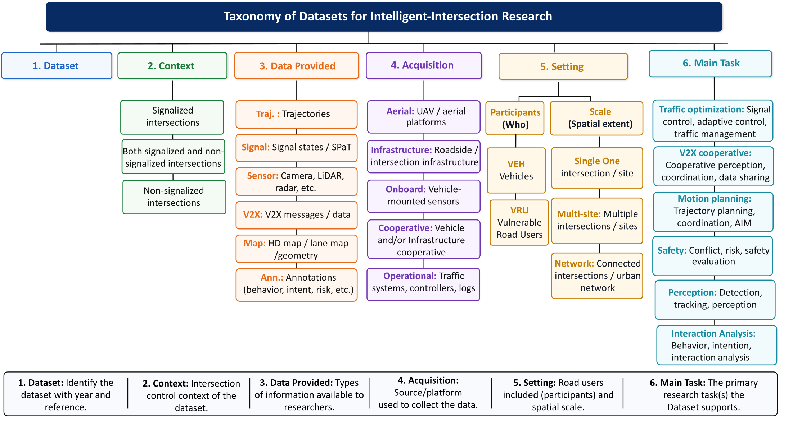
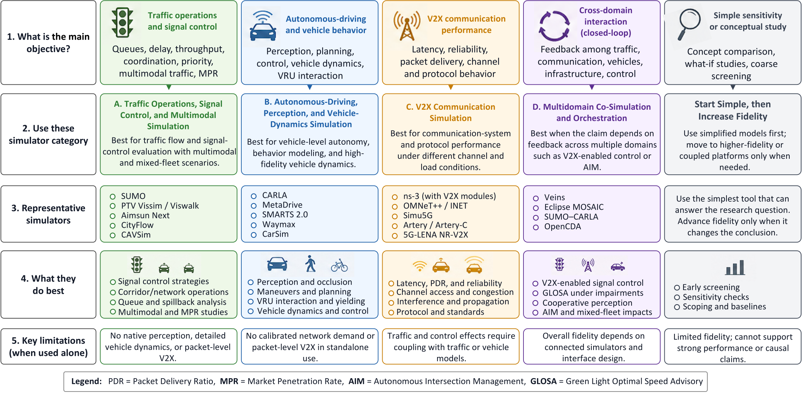

# Evaluation resources

[Back to the repository overview](../README.md) · [Datasets](datasets.md) · [Benchmarks](benchmarks.md) · [Simulators](simulators.md)

Evaluation resources are organized by what they can actually support—not only by file format or software category.

## Dataset taxonomy

The dataset index separates operational signal data, road-user trajectories and interactions, motion-planning corpora, and cooperative perception/V2X resources. A resource may span several groups; its row records acquisition mode, participants, scale, and supported tasks.

## Simulator selection

The simulator index distinguishes:

- traffic and signal simulation for demand, queues, timing, and network control;
- automated-driving simulation for sensors, behavior, motion planning, and vehicle dynamics;
- communication simulation for protocol, channel, latency, and loss;
- multidomain co-simulation for coupled vehicle, traffic, communication, and infrastructure experiments.

## Task vocabulary

| Task | Typical outputs | Resource requirements |
|---|---|---|
| Traffic optimization | delay, queue, stops, throughput, travel time | demand, routes, signal/controller state, closed-loop traffic response |
| Motion planning | feasibility, comfort, efficiency, rule compliance | road geometry, dynamic actors, trajectories, interaction context |
| V2X cooperation | awareness, coordination, perception or control gain | communication endpoints, messages, latency/loss or cooperative sensor data |
| Safety assessment | conflicts, surrogate measures, collisions, violations | sufficiently detailed trajectories, geometry, and participant classes |
| Interaction analysis | yielding, negotiation, intent, gap acceptance | synchronized trajectories and contextual right-of-way information |

Formal benchmark status should not be inferred from dataset popularity. [`data/benchmarks.csv`](../data/benchmarks.csv) explicitly separates formal benchmarks from benchmark-supporting scenarios.

See the [complete evaluation-resource citation page](references/evaluation-resources.md) for all dataset, benchmark, simulator, co-simulation, calibration, and reproducibility references used in the manuscript.
