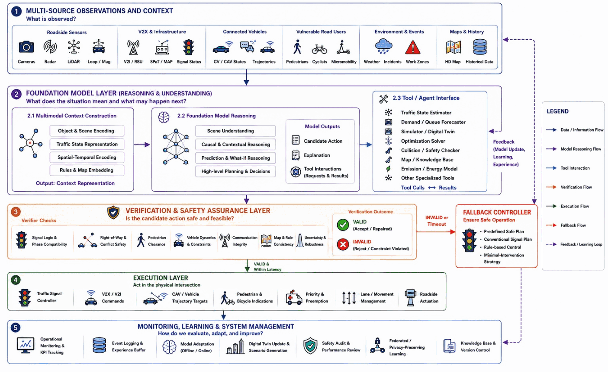

# Foundation-model assistance

[Back to the repository overview](../README.md) · [Complete paper index](papers.md)

Foundation models can support an intelligent intersection without being granted direct control authority. The survey therefore classifies both the model's role and the safety boundary around it.

## Role tags

| Role | Typical uses | Intersection-control claim |
|---|---|---|
| **Direct** | Generate candidate phases, policies, coordination plans, or high-level driving actions | Requires intersection-specific closed-loop validation and a bounded execution interface |
| **Enabling** | Perception/scene understanding, simulation generation, explanation, operator interaction, tool use, adaptation | Improves a subsystem; does not by itself establish safe control performance |
| **Adjacent** | General autonomous-driving reasoning, language-conditioned planning, or multimodal driving research | Relevant evidence, but not a validated intersection-management method |

## Authority boundary

| Model output | Recommended execution boundary |
|---|---|
| Explanation or operator summary | Human review; provenance and uncertainty visible |
| Scenario, reward, or configuration proposal | Schema validation, sandbox simulation, and regression tests |
| Candidate signal plan or vehicle maneuver | Deterministic feasibility and safety filter before actuation |
| Direct low-level actuation | Outside the evidence supported by most current foundation-model studies; demands independent safety assurance and fallback |

## Evidence expected for direct-control claims

- A clear action space, update rate, context window, and tool/API specification.
- Validity checks for phase conflicts, minimum timing, clearance, right-of-way, kinematics, and collision avoidance.
- Comparison with strong traffic-engineering, optimization, and learning baselines.
- Closed-loop tests across demand, incidents, sensing noise, communication loss, and out-of-distribution scenes.
- Runtime, cost, repeatability, model/version details, and deterministic fallback behavior.
- Human factors and cybersecurity analysis when natural-language or remote tools affect operations.

The current code-backed examples in the collection include [LLMLight](https://github.com/usail-hkust/LLMTSCS), [CoLLMLight](https://github.com/usail-hkust/CoLLMLight), [PromptGAT](https://github.com/DaRL-LibSignal/PromptGAT), and [TrafficGPT](https://github.com/lijlansg/TrafficGPT).
