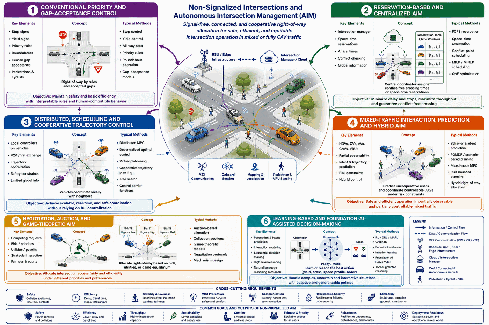

# Non-signalized intersections and AIM

[Back to the repository overview](../README.md) · [Section citation catalog](references/non-signalized-aim.md) · [Core comparison papers](papers.md)

This area ranges from human gap acceptance to centralized reservation systems for fully connected automated vehicles. The survey keeps those operating assumptions visible because an algorithm that controls every vehicle does not automatically transfer to a public mixed-traffic intersection.

## Research streams

| Research stream | Information | Decision or interaction | Representative linked papers |
|---|---|---|---|
| Gap acceptance and priority rules | Arrival, speed, conflict gap, priority | Enter, yield, or wait | [Albano et al.](https://doi.org/10.1007/s42421-024-00088-z); [Li et al.](https://doi.org/10.1007/s42154-023-00219-2) |
| Centralized reservation AIM | Connected trajectories and requests | Space-time reservation or crossing order | [Dresner and Stone](https://doi.org/10.1613/jair.2502); [Levin and Rey](https://doi.org/10.1016/j.trc.2017.09.025); [Fayazi and Vahidi](https://doi.org/10.1109/TIV.2018.2843163); [PAIM](https://doi.org/10.1109/ITSC.2018.8569782) |
| Distributed cooperative control | Local state, messages, intent | Negotiated or decentralized actions | [Xu et al.](https://www.researchgate.net/profile/Biao_Xu14/publication/326745925_Distributed_conflict-free_cooperation_for_multiple_connected_vehicles_at_unsignalized_intersections/links/5b681876a6fdcc188348152f/Distributed-conflict-free-cooperation-for-multiple-connected-vehicles-at-unsignalized-intersections.pdf); [Katriniok et al.](https://doi.org/10.1109/TITS.2022.3162038); [Xu et al.](https://doi.org/10.1109/TITS.2022.3151080); [Luo et al.](https://doi.org/10.1109/TITS.2023.3243940) |
| Mixed-traffic coordination | Partial CAV state plus inferred HDV behavior | CAV actions, gaps, virtual signals, or advisories | [Chen et al.](https://doi.org/10.1145/3566097.3567849); [Zhou et al.](https://doi.org/10.1109/TVT.2025.3630320); [Pappas et al.](https://doi.org/10.1016/j.ifacol.2024.07.334); [Pourjafari et al.](https://doi.org/10.1109/TIV.2023.3321275) |
| Negotiation, auction, and game-theoretic AIM | Requests, bids, utilities, intent | Priority, allocation, or negotiated motion | [Buckman et al.](https://doi.org/10.1109/IROS40897.2019.8967997); [Carlino et al.](https://doi.org/10.1109/ITSC.2013.6728285); [Wei et al.](https://doi.org/10.1109/ITSC.2018.8569307); [Li et al.](https://doi.org/10.3390/machines11050573) |
| Learning and foundation-model assistance | Histories, observations, learned representations | Policy, intent prediction, or high-level decision | [COOR-PLT](https://doi.org/10.1016/j.trc.2022.103933); [CoBT](https://doi.org/10.3390/s24165187); [RGRL](https://doi.org/10.1016/j.trc.2024.104807); [MTD-GPT](https://doi.org/10.1109/ITSC57777.2023.10421993) |

## Assumptions to report

1. Intersection control: priority rules, stop/yield control, virtual signal, or signal-free AIM.
2. Participants: HDV, CV, AV, CAV, pedestrian, cyclist, and other VRU classes.
3. Authority: which actors are observed, communicated with, advised, or directly controlled.
4. Communications: message content, range, latency, loss, and behavior on failure.
5. Safety mechanism: collision constraints, reachability, fallback, or supervisory override.
6. Evidence: synthetic simulation, recorded-data replay, closed-loop simulation, hardware, track, or public road.

Observability is not controllability. Connectivity may improve state estimation while leaving the human driver fully responsible for motion. Conversely, automated vehicles may be controllable without infrastructure connectivity. These distinctions are central to the survey taxonomy.

See the [complete non-signalized/AIM reference catalog](references/non-signalized-aim.md) for every work cited in the manuscript section.
