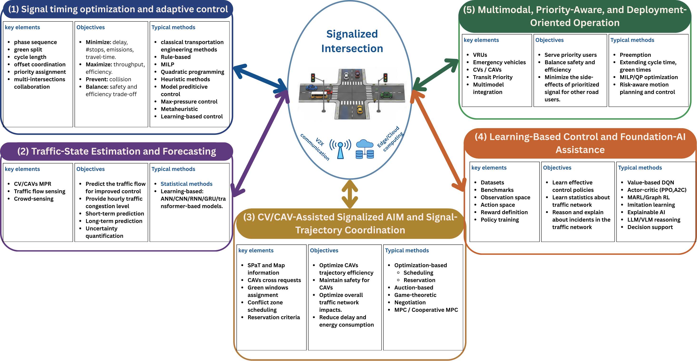

# Signalized intersections

[Back to the repository overview](../README.md) · [Section citation catalog](references/signalized.md) · [Core comparison papers](papers.md)

Signalized-intersection research spans more than phase selection. The survey separates five streams by the information consumed and the decision produced. This makes it easier to compare a detector-based controller with a trajectory optimizer or a multimodal priority policy without treating them as interchangeable.

## Research streams

| Research stream | Main information | Typical decision or output | Representative linked papers |
|---|---|---|---|
| Traffic-responsive signal control | Counts, occupancies, queues, phase state | Phase, split, cycle, offset | [Webster](https://www.sinaldetransito.com.br/artigos/traffic_signals_webster.pdf); [SCOOT](https://www.trl.co.uk/uploads/trl/documents/LR1014.pdf); [RHODES](https://doi.org/10.1016/S0968-090X(00)00047-4); [SURTRAC](https://doi.org/10.1609/icaps.v23i1.13594); [max-pressure](https://doi.org/10.1016/j.trc.2013.08.014) |
| State estimation and prediction | Detector events, probe trajectories, SPaT/MAP | Queue, arrival profile, turning demand, near-term state | [Liu et al.](https://doi.org/10.1016/j.trc.2009.02.003); [Tan et al.](https://doi.org/10.1109/TITS.2019.2954937); [DCRNN](https://openreview.net/forum?id=SJiHXGWAZ); [STGCN](https://doi.org/10.24963/ijcai.2018/505) |
| Signal-trajectory or eco-driving coordination | SPaT/MAP, vehicle states, route or platoon intent | Speed advisory, trajectory, platoon approach, sometimes signal timing | [Goodall et al.](https://doi.org/10.3141/2381-08); [Feng et al.](https://doi.org/10.1016/j.trc.2018.02.001); [Tajalli and Hajbabaie](https://doi.org/10.1109/TITS.2021.3058193); [Wang et al.](https://doi.org/10.1109/TITS.2019.2911607) |
| Learning-based control | Encoded traffic state, reward, graph context | Phase or timing policy | [IntelliLight](https://doi.org/10.1145/3219819.3220096); [FRAP](https://doi.org/10.1145/3357384.3357900); [PressLight](https://doi.org/10.1145/3292500.3330949); [CoLight](https://doi.org/10.1145/3357384.3357902); [LLMLight](https://doi.org/10.1145/3690624.3709379) |
| Multimodal, priority, and safety-aware control | Transit/emergency requests, pedestrian and cyclist state, conflict indicators | Priority, phase extension, service order, protective timing | [Yu et al.](https://doi.org/10.1016/j.trb.2016.12.015); [Qin and Khan](https://doi.org/10.1016/j.trc.2012.04.004); [Humagain et al.](https://doi.org/10.1080/01441647.2019.1649319); [Zhong et al.](https://doi.org/10.1109/ACCESS.2022.3149920) |

## Reading the evidence correctly

- A signal controller and a vehicle advisory system have different control authority even when both use SPaT.
- Closed-loop simulation is stronger than trace replay for evaluating an adaptive controller, but it is not field evidence.
- Network-level results should report coordination topology and communication assumptions.
- Mixed-traffic claims should state which vehicles are observable, connected, and controllable—not only a market-penetration percentage.

The complete set of references cited in this manuscript section is available in the [signalized reference catalog](references/signalized.md). Detailed core-paper records and verified implementation status are in [`data/papers.csv`](../data/papers.csv).
